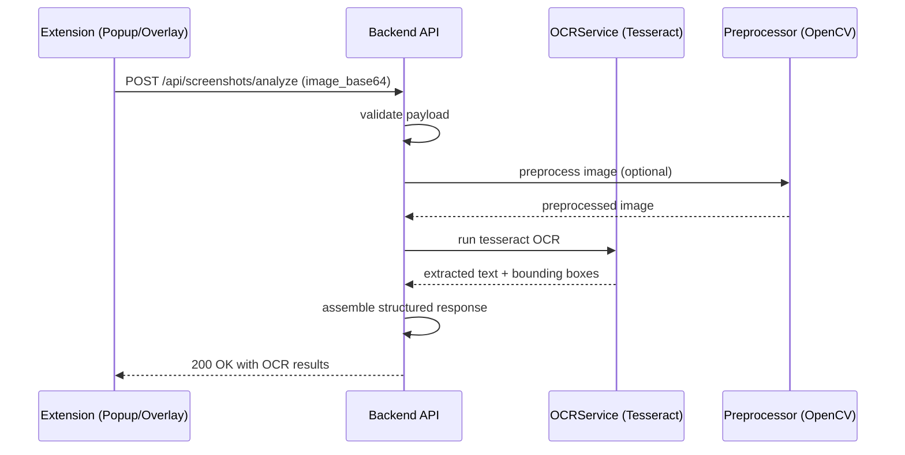

# OCR Sequence Diagram

```mermaid
sequenceDiagram
    participant Ext as Extension (Popup/Overlay)
    participant BE as Backend API
    participant OCR as OCRService (Tesseract)
    participant CV as Preprocessor (OpenCV)

    Ext->>BE: POST /api/screenshots/analyze (image_base64)
    BE->>BE: validate payload
    BE->>CV: preprocess image (optional)
    CV-->>BE: preprocessed image
    BE->>OCR: run tesseract OCR
    OCR-->>BE: extracted text + bounding boxes
    BE->>BE: assemble structured response
    BE-->>Ext: 200 OK with OCR results
```
